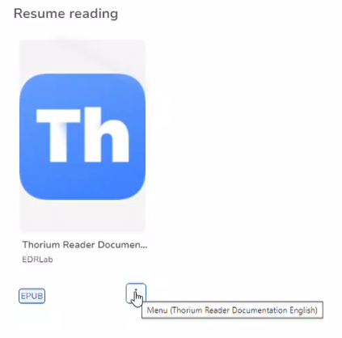
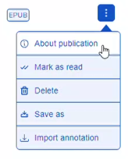

| key| english| context | screenshot| 
| --- | --- | --- | --- |
| accessibility.bookMenu| Menu	| in the Bookshelf, each book has a three dots button to access book menu | | 
| accessibility.closeDialog| Close	| | | 
| accessibility.importFile| Import publication	| | | 
| accessibility.leftSlideButton| Slide to the left	| | | 
| accessibility.mainContent| main content	| | | 
| accessibility.rightSlideButton| Slide to the right	| | | 
| accessibility.skipLink| Skip to content	| | | 
| accessibility.toolbar| toolbar	| | | 
| apiapp.documentation| Thorium Documentation	| | | 
| apiapp.howItWorks| How does it work?	| | | 
| apiapp.informations| In France, many public libraries provide a machine-readable catalog (similar to OPDS but not identical), letting patrons download digital publications from their personal bookshelf. Integrating this technology in Thorium Reader allows you to download an ebook or audiobook directly into Thorium Reader for instant reading.| How do you connect your French public library account to Thorium Reader? It's simple. Enter a French city ('Paris') or part of the library name in the Search field and hit the Search button. A list of public libraries corresponding to your search will appear. Select a library and hit Add. In the updated list of catalogs, select this library: an authentication form is displayed. Enter your username/email address and password, and hit Login. You can now see the content of your personal bookshelf, from which you can download and read the ebooks and audiobooks you previously borrowed.	| | | 
| apiapp.noLibraryFound| No library found ({{- name}})	| | | 
| app.edit.copy| Copy	| | | 
| app.edit.cut| Cut	| | | 
| app.edit.paste| Paste	| | | 
| app.edit.redo| Redo	| | | 
| app.edit.selectAll| Select all	| | | 
| app.edit.title| Edit	| | | 
| app.edit.undo| Undo	| | | 
| app.hide| Hide {{- appName}}	| | | 
| app.quit| Quit {{- appName}}	| | | 
| app.session.exit.askBox.button.no| No	| | | 
| app.session.exit.askBox.button.yes| Yes	| | | 
| app.session.exit.askBox.message| Do you want to save the session?	| | | 
| app.session.exit.askBox.title| Save session	| | | 
| app.update.message| New version available, click to learn more.	| | | 
| app.update.title| {{- appName}} software update.	| | | 
| app.window.showLibrary| Show library / bookshelf	| | | 
| catalog.about.title| About {{- appName}}	| | | 
| catalog.addBookToLib| Import	| | | 
| catalog.addTags| Add tag	| | | 
| catalog.addTagsButton| Add	| | | 
| catalog.allBooks| All publications	| | | 
| catalog.bookInfo| About publication	| First element of the book menu | | 
| catalog.column.ascending| ascending	| | | 
| catalog.column.descending| descending	| | | 
| catalog.column.unsorted| unsorted	| | | 
| catalog.delete| Delete	| | | 
| catalog.deleteBook| Delete	| | | 
| catalog.deleteTag| Delete tag	| | | 
| catalog.description| Description	| | | 
| catalog.emptyTagList| No tagged publications.	| | | 
| catalog.entry.continueReading| Resume reading	| | | 
| catalog.entry.continueReadingAudioBooks| Resume listening	| | | 
| catalog.entry.continueReadingDivina| Resume divina	| | | 
| catalog.entry.continueReadingPdf| Resume PDF	| | | 
| catalog.entry.lastAdditions| Recently added	| | | 
| catalog.export| Save as	| | | 
| catalog.exportAnnotation| Save annotation as	| | |
|  catalog.format| Format	| | | 
| catalog.importAnnotation| Import annotation	| | |
|  catalog.lang| Language	| | | 
| catalog.lastRead| Last Read	| | | 
| catalog.moreInfo| Publication Details	| | | 
| catalog.myBooks| My publications	| | | 
| catalog.noPublicationHelpL1| Drop files here	| | | 
| catalog.noPublicationHelpL2| or use the "{{- importTitle }}" button above.	| | | 
| catalog.noPublicationHelpL3| LCP-protected publications are supported.	| | | 
| catalog.noPublicationHelpL4| Supported extensions:	| | | 
| catalog.numberOfPages| Number of pages	| | | 
| catalog.opds.auth.cancel| Cancel	| | | 
| catalog.opds.auth.login| Login	| | | 
| catalog.opds.auth.password| Password	| | | 
| catalog.opds.auth.register| Register	| | | 
| catalog.opds.auth.username| Username / Email Address	| | | 
| catalog.opds.info.availableSince| Since	| | | 
| catalog.opds.info.availableState.available| Available	| | | 
| catalog.opds.info.availableState.ready| Ready	| | | 
| catalog.opds.info.availableState.reserved| Reserved	| | | 
| catalog.opds.info.availableState.unavailable| Unavailable	| | | 
| catalog.opds.info.availableState.unknown| Unknown	| | | 
| catalog.opds.info.availableUntil| Until	| | | 
| catalog.opds.info.copyAvalaible| Available	| | | 
| catalog.opds.info.copyTotal| Copies	| | | 
| catalog.opds.info.holdPosition| Hold position	| | | 
| catalog.opds.info.holdTotal| Held	| | | 
| catalog.opds.info.numberOfItems| Number of items	| | | 
| catalog.opds.info.priveValue| Price	| | | 
| catalog.opds.info.state| State	| | | 
| catalog.publisher| Publisher	| | | 
| catalog.readBook| Read	| | | 
| catalog.released| Published on	| | | 
| catalog.sort| Sort by	| | | 
| catalog.tag| Tag	| | | 
| catalog.tags| Tags	| | | 
| catalog.update| Edit	| | | 
| dialog.annotations.descAuthor| of {{- author}}	| | |
|  dialog.annotations.descList| {{- nb}} note(s) from {{- creator}} will be associated with {{- title}} {{- author}}	| | |
|  dialog.annotations.descNewer| {{- nb}} newer versions of these notes are already associated with the publication.	| | |
|  dialog.annotations.descOlder| {{- nb}} older versions of these notes are already associated with the publication.	| | |
|  dialog.annotations.descTitle| Annotation Set Title:	| | |
|  dialog.annotations.importAll| Import all notes	| | |
|  dialog.annotations.importWithoutConflict| Import notes without conflict	| | |
|  dialog.annotations.title| Do you want to import these notes ?	| | |
|  dialog.cancel| Cancel	| | | 
| dialog.deleteAnnotations| Delete annotations?	| | |
|  dialog.deleteAnnotationsText| Do you want to delete {{- annotationListLength}} annotation(s)?	| | | 
| dialog.deleteFeed| Delete catalog?	| | | 
| dialog.deletePublication| Delete publication?	| | | 
| dialog.import| Confirm import:	| | | 
| dialog.importError| An error occurred, verify the file extension ({{acceptedExtension}})	| | | 
| dialog.renew| Renew/extend loan?	| | | 
| dialog.return| Return publication?	| | | 
| dialog.yes| Yes	| | | 
| error.errorBox.error| Error message:	| | | 
| error.errorBox.message| Error in {{- filename}}	| | | 
| error.errorBox.title| Internal {{- appName}} Error	| | | 
| header.allBooks| All publications	| | | 
| header.catalogs| Catalogs	| | | 
| header.downloads| Downloads	| | | 
| header.fitlerTagTitle| Filter by tag	| | | 
| header.gridTitle| Grid	| | | 
| header.home| Bookshelf menu	| | | 
| header.homeTitle| Home	| | | 
| header.importTitle| Import publication	| | | 
| header.listTitle| Table	| | | 
| header.myCatalogs| My catalogs	| | | 
| header.refreshTitle| reload	| | | 
| header.searchPlaceholder| Search	| | | 
| header.searchTitle| Search	| | | 
| header.settings| Settings	| | | 
| header.viewMode| View mode	| | | 
| library.lcp.hint| Hint:	| | | 
| library.lcp.open| Open	| | | 
| library.lcp.password| Passphrase	| | | 
| library.lcp.sentence| This publication needs an LCP passphrase to be opened	| | | 
| library.lcp.urlHint| Forgot your passphrase? Click here to get support.	| | | 
| library.lcp.whatIsLcp?| What is LCP?	| | | 
| library.lcp.whatIsLcpInfoDetails| LCP stands for 'Licensed Content Protection'.	| | | 
| library.lcp.whatIsLcpInfoDetailsLink| To learn more, click this link to the EDRLab website.	| | | 
| message.annotations.alreadyImported| All annotations already imported, aborting the importation	| | | 
| message.annotations.emptyFile| No annotations available in the file	| | |
|  message.annotations.errorParsing| Error file format parsing:	| | |
|  message.annotations.noBelongTo| Unable to import annotations set, at least one annotation does not belong to the publication	| | |
|  message.annotations.nothing| There are no annotations ready to be imported, aborting the importation	| | |
|  message.annotations.success| Success !	| | |
|  message.download.error| Downloading [{{- title}}] failed: [{{- err}}]	| | | 
| message.import.alreadyImport| [{{- title}}] was already imported.	| | | 
| message.import.fail| Importing [{{- path}}] failed: [{{- err}}]	| | | 
| message.import.success| Importing [{{- title}}] completed.	| | | 
| message.open.error| Loading publication failed: [{{- err}}]	| | | 
| opds.addForm.addButton| Add	| | | 
| opds.addForm.name| Name:	| | | 
| opds.addForm.namePlaceholder| Name	| | | 
| opds.addForm.url| Link:	| | | 
| opds.addForm.urlPlaceholder| Link	| | | 
| opds.addFormApiapp.title| Add library account	| | | 
| opds.addMenu| Add OPDS feed	| | | 
| opds.breadcrumbRoot| Catalogs	| | | 
| opds.documentation| OPDS official website	| | | 
| opds.empty| No publication found	| | | 
| opds.firstPage| First	| | | 
| opds.informations| Imagine a world where you can explore and download digital publications from public libraries and digital booksellers with just a few clicks. That's exactly what the Open Publication Distribution System (OPDS) catalog format offers. With OPDS, you can navigate through catalogs from various ebook providers, sign up, borrow, buy a publication, or visit your personal bookshelf. You can even download an ebook or audiobook directly into Thorium Reader for instant reading.| So, how do you find an OPDS catalog? It's simple. Look for a hyperlink (URL) leading to the catalog. Copy this URL into the Link field above. Keep in mind that there's no one-stop shop for all active OPDS catalogs. You'll need to contact your preferred library or bookseller and ask for their OPDS catalog URL. If you're not sure where to start, Wikipedia has a few registries of OPDS catalogs in various languages that might be helpful.| The Name field is left at your convenience; it provides an easy way to identify the feed in Thorium Reader.	| | | 
| opds.lastPage| Last	| | | 
| opds.menu.aboutBook| About publication	| | | 
| opds.menu.addExtract| Import extract	| | | 
| opds.menu.goBuyBook| Buy publication	| | | 
| opds.menu.goLoanBook| Borrow publication	| | | 
| opds.menu.goRevokeLoanBook| Revoke loan	| | | 
| opds.menu.goSubBook| Subscribe	| | | 
| opds.network.error| Error accessing feed	| | | 
| opds.network.noInternet| No internet	| | | 
| opds.network.noInternetMessage| Try checking the network cable, modem, router or wifi	| | | 
| opds.network.reject| Sorry, unexpected error!	| | | 
| opds.network.timeout| Network timeout, please try again later	| | | 
| opds.next| Next	| | | 
| opds.previous| Previous	| | | 
| opds.shelf| Shelf	| | | 
| opds.updateForm.name| Name:	| | | 
| opds.updateForm.title| Edit OPDS feed	| | | 
| opds.updateForm.updateButton| Edit	| | | 
| opds.updateForm.url| Link:	| | | 
| opds.whatIsOpds| What Is OPDS?	| | | 
| publication.accessibility.accessModeSufficient.textual| TTS & Screen reader friendly	| | | 
| publication.accessibility.accessibilityFeature.alternativeText| Contains alternative text	| | | 
| publication.accessibility.accessibilityFeature.displayTransformability| Adaptable text and layout	| | | 
| publication.accessibility.accessibilityFeature.longDescription| Fully described graphical resources	| | | 
| publication.accessibility.accessibilityFeature.printPageNumbers| Printed book pagination reference	| | | 
| publication.accessibility.accessibilityFeature.readingOrder| Contains a reading order	| | | 
| publication.accessibility.accessibilityFeature.synchronizedAudioText| Text & audio synchronised	| | | 
| publication.accessibility.accessibilityFeature.tableOfContents| Contains a Table Of Contents	| | | 
| publication.accessibility.accessibilityHazard.flashing| Flashing	| | | 
| publication.accessibility.accessibilityHazard.motionSimulation| Motion simulation	| | | 
| publication.accessibility.accessibilityHazard.name| Hazard:	| | | 
| publication.accessibility.accessibilityHazard.noFlashing| No flashing	| | | 
| publication.accessibility.accessibilityHazard.noMotionSimulation| No motion simulation	| | | 
| publication.accessibility.accessibilityHazard.noSound| No sound	| | | 
| publication.accessibility.accessibilityHazard.none| None	| | | 
| publication.accessibility.accessibilityHazard.sound| Sound	| | | 
| publication.accessibility.accessibilityHazard.unknown| Unknown	| | | 
| publication.accessibility.certifierReport| Certifier report:	| | | 
| publication.accessibility.conformsTo| Conforms to:	| | | 
| publication.accessibility.moreInformation| More information	| | | 
| publication.accessibility.name| Accessibility	| | | 
| publication.accessibility.noA11y| No accessibility information available	| | | 
| publication.actions| Actions	| | | 
| publication.audio.tracks| Tracks	| | | 
| publication.author| Author	| | | 
| publication.cancelledLcp| This publication's LCP license is cancelled.	| | | 
| publication.certificateRevoked| Revoked LCP license certificate.	| | | 
| publication.certificateSignatureInvalid| Invalid LCP license certificate signature.	| | | 
| publication.cover.img| cover image	| | | 
| publication.day| day	| | | 
| publication.days| days	| | | 
| publication.duration.title| Duration	| | | 
| publication.encryptedNoLicense| Publication is encrypted but lacks an LCP license!	| | |
|  publication.expired| Loan expired	| | | 
| publication.expiredLcp| This publication's LCP license is expired.	| | | 
| publication.incorrectPassphrase| No stored passphrase fits the publication, or the entered passphrase is wrong.	| | | 
| publication.lcpEnd| End	| | | 
| publication.lcpRightsCopy| Copied characters	| | | 
| publication.lcpRightsPrint| Printed pages	| | | 
| publication.lcpStart| Start	| | | 
| publication.licenceLCP| License (LCP)	| | | 
| publication.licenseOutOfDate| Out of date LCP License.	| | | 
| publication.licenseSignatureDateInvalid| Invalid LCP license signature date.	| | | 
| publication.licenseSignatureInvalid| Invalid LCP license signature.	| | | 
| publication.licensed| Licensed	| | | 
| publication.markAsRead| Mark as read	| | | 
| publication.notStarted| Not Started	| | | 
| publication.onGoing| In Progress	| | | 
| publication.progression.title| Progression	| | | 
| publication.read| Finished	| | | 
| publication.remainingTime| Loan (remaining time)	| | | 
| publication.renewButton| Renew	| | | 
| publication.returnButton| Return	| | | 
| publication.returnedLcp| This LCP-protected publication is returned.	| | | 
| publication.revokedLcp| This publication's LCP license is revoked.	| | | 
| publication.seeLess| See less	| | | 
| publication.seeMore| See more	| | | 
| publication.timeLeft| Remaining time	| | | 
| publication.title| Title	| | | 
| publication.userKeyCheckInvalid| Incorrect passphrase.	| | | 
| reader.annotations.Color| Color	| | | 
| reader.annotations.addNote| Annotate	| | | 
| reader.annotations.advancedMode| Instant mode (auto create after select)	| | | 
| reader.annotations.annotationsExport.description| Name this set of annotations	| | | 
| reader.annotations.annotationsExport.title| Title	| | | 
| reader.annotations.annotationsOptions| Options	| | | 
| reader.annotations.colors.bluegreen| Blue-green	| | | 
| reader.annotations.colors.cyan| Cyan	| | |
|  reader.annotations.colors.green| Green	| | |
|  reader.annotations.colors.lightblue| Light Blue	| | |
|  reader.annotations.colors.orange| Orange	| | | 
| reader.annotations.colors.purple| Purple	| | | 
| reader.annotations.colors.red| Red	| | | 
| reader.annotations.colors.yellow| Yellow	| | |
|  reader.annotations.filter.all| All	| | |
|  reader.annotations.filter.filterByColor| Filter by Color	| | |
|  reader.annotations.filter.filterByCreator| Filter by Creator	| | |
|  reader.annotations.filter.filterByDrawtype| Filter by Drawtype	| | |
|  reader.annotations.filter.filterByTag| Filter by Tag	| | |
|  reader.annotations.filter.filterOptions| Filter Options	| | |
|  reader.annotations.filter.none| None	| | |
|  reader.annotations.hide| Do not display	| | | 
| reader.annotations.highlight| Highlight	| | | 
| reader.annotations.noSelectionToast| No selection	| | | 
| reader.annotations.quickAnnotations| Quick create (skip editor)	| | | 
| reader.annotations.saveNote| Save	| | | 
| reader.annotations.sorting.lastcreated| Last created	| | |
|  reader.annotations.sorting.lastmodified| Last modified	| | |
|  reader.annotations.sorting.progression| Progression	| | |
|  reader.annotations.sorting.sortingOptions| Sorting Options	| | |
|  reader.annotations.toggleMarginMarks| Display in margins	| | | 
| reader.annotations.type.outline| Outline	| | | 
| reader.annotations.type.solid| Solid background	| | | 
| reader.annotations.type.strikethrough| Strikethrough	| | | 
| reader.annotations.type.underline| Underline	| | | 
| reader.divina.mute| mute audio	| | | 
| reader.divina.unmute| unmute audio	| | | 
| reader.fxl.fit| Fit	| | | 
| reader.marks.annotations| Annotations	| | | 
| reader.marks.bookmarks| Bookmarks	| | | 
| reader.marks.delete| Delete	| | | 
| reader.marks.edit| Edit	| | | 
| reader.marks.goTo| Go to page	| | | 
| reader.marks.landmarks| Landmarks	| | | 
| reader.marks.saveMark| Save bookmark	| | | 
| reader.marks.search| Search	| | | 
| reader.marks.searchResult| Search [{{- searchText}}]	| | | 
| reader.marks.toc| Table of Contents	| | | 
| reader.media-overlays.activate| Activate Readaloud	| | | 
| reader.media-overlays.captions| Captions / clean view	| | | 
| reader.media-overlays.captionsDescription| Simplified text view with minimal captions styling.	| | | 
| reader.media-overlays.next| Next Readaloud	| | | 
| reader.media-overlays.pause| Pause Readaloud	| | | 
| reader.media-overlays.play| Play Readaloud	| | | 
| reader.media-overlays.previous| Previous Readaloud	| | | 
| reader.media-overlays.skip| Skippability	| | | 
| reader.media-overlays.skipDescription| Jump over / ignore auxiliary content such as pagebreaks, footnotes/endnotes, etc.	| | | 
| reader.media-overlays.speed| Readaloud playback rate	| | | 
| reader.media-overlays.stop| Stop Readaloud	| | | 
| reader.media-overlays.title| Readaloud	| | | 
| reader.navigation.annotationTitle| annotation	| | | 
| reader.navigation.backHomeTitle| back to bookshelf	| | | 
| reader.navigation.bookmarkTitle| bookmark	| | | 
| reader.navigation.currentPage| Current page: {{- current}}	| | | 
| reader.navigation.currentPageTotal| Current page: {{- current}}/{{- total}}	| | | 
| reader.navigation.detachWindowTitle| show library / bookshelf window	| | | 
| reader.navigation.fullscreenTitle| go fullscreen	| | | 
| reader.navigation.goTo| Go to	| | | 
| reader.navigation.goToError| Page break does not exist	| | | 
| reader.navigation.goToPlaceHolder| Enter page number	| | | 
| reader.navigation.goToTitle| Go to page	| | | 
| reader.navigation.historyNext| Jump forward	| | | 
| reader.navigation.historyPrevious| Jump back	| | | 
| reader.navigation.infoTitle| information	| This leads to the same panel previously c&alled by About, therefore, should be similarly labeled| | 
| reader.navigation.magnifyingGlassButton| search publication	| | | 
| reader.navigation.openTableOfContentsTitle| navigation	| | | 
| reader.navigation.page| Page	| | | 
| reader.navigation.pdfscalemode| Page fit or width	| | | 
| reader.navigation.settingsTitle| settings	| | | 
| reader.picker.search.founds| {{- nResults}} match(es)	| | | 
| reader.picker.search.input| text to match	| | | 
| reader.picker.search.next| Next	| | | 
| reader.picker.search.notFound| no matches	| | | 
| reader.picker.search.previous| Previous	| | | 
| reader.picker.search.results| Results	| | | 
| reader.picker.search.submit| Find	| | | 
| reader.picker.searchTitle| Search:	| | | 
| reader.settings.column.auto| Default	| | | 
| reader.settings.column.one| 1 col	| | | 
| reader.settings.column.title| Columns	| | | 
| reader.settings.column.two| 2 cols	| | | 
| reader.settings.customFontSelected| You have chosen a personal font	| | | 
| reader.settings.customizeReader| Customize text formatting	| | | 
| reader.settings.disabled| disabled	| | | 
| reader.settings.display| Display	| | | 
| reader.settings.disposition.title| Layout	| | | 
| reader.settings.font| Font	| | | 
| reader.settings.fontSize| Font size	| | | 
| reader.settings.infoCustomFont| Select custom font from operating system by typing its name	| | | 
| reader.settings.justification| Alignment	| | | 
| reader.settings.justify| Justify	| | | 
| reader.settings.letterSpacing| Letter spacing	| | | 
| reader.settings.lineSpacing| Line spacing	| | | 
| reader.settings.margin| Margin	| | | 
| reader.settings.noFootnotes| Disable footnotes	| | | 
| reader.settings.noRTLFlip| Disable Right-To-Left UI	| | | 
| reader.settings.noRuby| Hide Japanese Ruby	| | | 
| reader.settings.paginated| Paginated	| | | 
| reader.settings.paraSpacing| Paragraph spacing	| | | 
| reader.settings.pdfZoom.name.100pct| 100%	| | | 
| reader.settings.pdfZoom.name.150pct| 150%	| | | 
| reader.settings.pdfZoom.name.200pct| 200%	| | | 
| reader.settings.pdfZoom.name.300pct| 300%	| | | 
| reader.settings.pdfZoom.name.500pct| 500%	| | | 
| reader.settings.pdfZoom.name.50pct| 50%	| | | 
| reader.settings.pdfZoom.name.fit| page fit	| | | 
| reader.settings.pdfZoom.name.width| page width	| | | 
| reader.settings.pdfZoom.title| Zoom	| | | 
| reader.settings.preset.apply| Apply the preferred reading parameters	| | | 
| reader.settings.preset.applyDetails| Apply the preferred reading settings preset to the current book.	| | | 
| reader.settings.preset.reset| Reset preferred reading settings	| | | 
| reader.settings.preset.resetDetails| Reset the preferred reading parameters and apply these default paremeters to the current book.	| | | 
| reader.settings.preset.save| Save the preferred reading parameters	| | | 
| reader.settings.preset.saveDetails| Save the customized text parameters, so that they might be applied to other books, once open, by clicking on the button below.	| | | 
| reader.settings.preset.title| Preset	| | | 
| reader.settings.preview| Preview	| | | 
| reader.settings.reduceMotion| Reduce motion	| | | 
| reader.settings.scrolled| Scrollable	| | | 
| reader.settings.spacing| Spacing	| | | 
| reader.settings.text| Text	| | | 
| reader.settings.theme.name.Contrast1| Contrast 1	| | | 
| reader.settings.theme.name.Contrast2| Contrast 2	| | | 
| reader.settings.theme.name.Contrast3| Contrast 3	| | | 
| reader.settings.theme.name.Contrast4| Contrast 4	| | | 
| reader.settings.theme.name.Neutral| Neutral	| | | 
| reader.settings.theme.name.Night| Night	| | | 
| reader.settings.theme.name.Paper| Paper	| | | 
| reader.settings.theme.name.Sepia| Sepia	| | | 
| reader.settings.theme.title| Theme	| | | 
| reader.settings.wordSpacing| Word spacing	| | | 
| reader.svg.left| Left	| | | 
| reader.svg.right| Right	| | | 
| reader.toc.publicationNoToc| No table of contents	| | | 
| reader.tts.activate| Activate Text To Speech (TTS)	| | | 
| reader.tts.default| Voice: system default	| | | 
| reader.tts.next| Next TTS	| | | 
| reader.tts.pause| Pause TTS	| | | 
| reader.tts.play| Play TTS	| | | 
| reader.tts.previous| Previous TTS	| | | 
| reader.tts.sentenceDetect| Split TTS text	| | | 
| reader.tts.sentenceDetectDescription| Break long paragraphs into sentences.	| | | 
| reader.tts.speed| TTS playback rate	| | | 
| reader.tts.stop| Stop TTS	| | | 
| reader.tts.voice| TTS voice	| | | 
| settings.annotationCreator.creator| Creator	| | |
|  settings.annotationCreator.name| Name	| | |
|  settings.annotationCreator.organization| Organization	| | |
|  settings.annotationCreator.person| Person	| | |
|  settings.annotationCreator.type| Type:	| | |
|  settings.auth.title| Manage access to catalogs	| | |
|  settings.auth.wipeData| Clear login data	| | | 
| settings.keyboard.advancedMenu| Keyboard shortcuts advanced menu	| | | 
| settings.keyboard.cancel| Cancel	| | | 
| settings.keyboard.disclaimer| Shortcuts were defined from QWERTY keyboard layout.	| | | 
| settings.keyboard.editUserJson| Edit user file...	| | | 
| settings.keyboard.keyboardShortcuts| Keyboard shortcuts	| | | 
| settings.keyboard.loadUserJson| Load from user file	| | | 
| settings.keyboard.resetDefaults| Reset (load defaults)	| | | 
| settings.keyboard.save| Save	| | | 
| settings.language.languageChoice| Language	| | | 
| settings.library.enableAPIAPP| Activate access to Dilicom PNB API	| | |
|  settings.library.title| Add a library account	| | |
|  settings.session.title| Save session	| | | 
| settings.tabs.appearance| Appearance	| | | 
| settings.tabs.general| General	| | | 
| settings.tabs.keyboardShortcuts| Keyboard shortcuts	| | | 
| settings.theme.auto| Automatic	| | | 
| settings.theme.dark| Dark	| | | 
| settings.theme.description| Application theme matches operating system.	| | | 
| settings.theme.light| Light	| | | 
| settings.theme.title| Application Theme	| | | 
| wizard.buttons.discover| Discover what's new	| | | 
| wizard.buttons.goToBooks| Go to my publications	| | | 
| wizard.buttons.next| Next	| | | 
| wizard.description.annotations| Highlight document text, choose style and color, attach personal notes. Create annotations in 'quick' mode to bypass the editor (you can enter text and customize styles later). For extra speed, use the 'instant' mode which creates annotations immediately after highlighting document text!	| | | 
| wizard.description.catalogs| Borrow publications from your local library or discover publications via OPDS feeds. Access a variety of publications from multiple sources thanks to online catalogs.	| | | 
| wizard.description.home| Thorium looks different! Let's discover what's new...	| | | 
| wizard.description.readingView1| Customize your reading and listening preferences: Thorium now offers multiple color themes for both the user interface and publication documents. It is now also easier to configure 'readaloud' ebooks with synthetic speech and synchronized text/audio narration.	| | | 
| wizard.description.readingView2| Thorium's improved user interface makes it easier to find text in publications, explore search results, go to specific pages, browse the table of contents, create bookmarks, etc. thanks to the new 'docked' panels. The fullscreen reading mode continues to offer a distraction-free environment.	| | | 
| wizard.description.yourBooks| Welcome to your redesigned personal bookshelf! In the 'grid' view, easily filter by tags or find publications by keywords. In the advanced 'table' view, select and sort publications by specific authors, title, date, format, etc.	| | | 
| wizard.dontShow| Don't show again	| | | 
| wizard.tab.annotations| Annotations	| | | 
| wizard.tab.catalogs| Catalogs	| | | 
| wizard.tab.home| Home	| | | 
| wizard.tab.readingView| Reading view	| | | 
| wizard.tab.yourBooks| Your publications	| | | 
| wizard.title.allBooks| All my publications	| | | 
| wizard.title.newFeature| New feature: Annotations	| | | 
| wizard.title.welcome| Welcome to Thorium 3.0	| | | 
| 